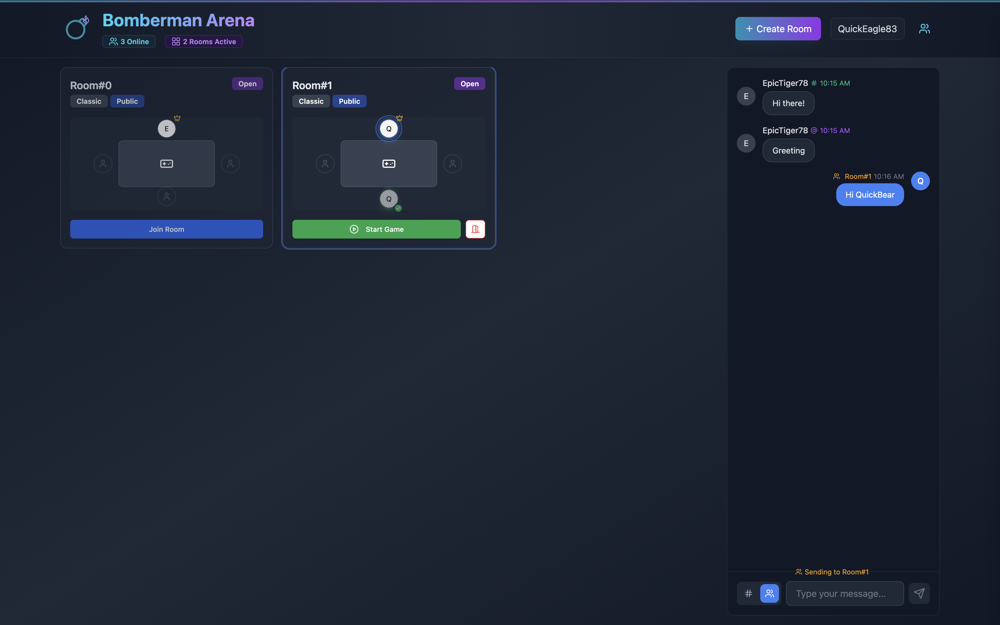

  <h1>🎮 Bomberman Online</h1>
  
A modern multiplayer Bomberman game you can play with friends

  <figure>
    
    
<i>Battle with up to 4 friends in fast-paced explosive action</i>

  </figure>

  

    <a href="https://dtszwai.github.io/Bomberman/">Play Now</a>
  

## ✨ What's Cool About This

- 💥 **Battle with Friends**: Create a room and invite up to 4 players for intense matches
- 🎯 **Smooth Controls**: Responsive movement and precise bomb placement
- 🏆 **Power-ups**: Collect items to increase your speed, bomb strength, and more
- 💬 **Chat System**: Talk with other players in the lobby
  <!-- - 🔄 **Auto Reconnect**: Never lose a game due to connection hiccups -->

 
 
<i>Create or join game rooms in the lobby</i>

 

<i>Ready up and wait for other players to join</i>

## 🎮 How to Play

1. **Create or Join a Room**

   - Click "Create Room" to start your own game
   - Or join an existing room from the lobby
   - Ready up and wait for other players to join
   - Start the game when two or more players are ready

2. **Controls**

   - Arrow Keys: Move your character
   - Space: Place a bomb

3. **Power-ups**
   - 🔥 Fire: Increases explosion range
   - 💣 Bomb: Adds an extra bomb
   - 👟 Speed: Makes you move faster

## 🚀 Quick Start

1. Visit [Bomberman Online](https://dtszwai.github.io/Bomberman/)
2. Create a room or join an existing one
3. Wait for friends to join
4. Start the game and have fun!

## 🛠️ Upcoming Features

- [ ] Custom room settings
- [ ] More power-up types
- [ ] Additional maps
- [ ] Tournament mode
- [ ] Profile customization
